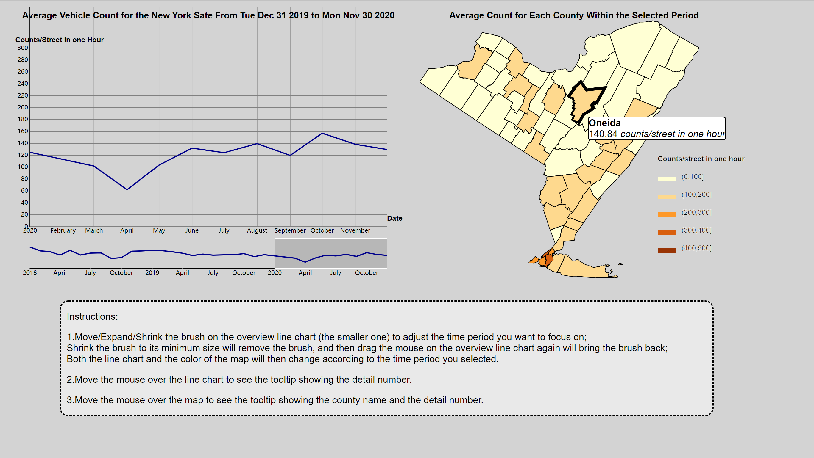

# Interactive component

## Link to the interactive component

[Click here!](http://tianhangcui.com/Visualization_for_New_York_State_Traffic_Data/index.html) or use the URL: http://tianhangcui.com/Visualization_for_New_York_State_Traffic_Data/index.html

## Instructions

1.Move/Expand/Shrink the brush on the overview line chart (the smaller one) to adjust the time period you want to focus on;
Shrink the brush to its minimum size will remove the brush, and then drag the mouse on the overview line chart again will bring the brush back;
Both the line chart and the color of the map will then change according to the time period you selected.

2.Move the mouse over the line chart to see the tooltip showing the detail number.

3.Move the mouse over the map to see the tooltip showing the county name and the detail number.

## Description

The interactive plots are built with D3 version 7, anyone can check the code by using: developer tools->resources, or via the github page [here](https://github.com/thcui/Visualization-for-New-York-State-Traffic-Data/tree/main/06-interactive). 

The line chart shows the average count for per street per hour for the entire New York State, using can change the time period by shrink/expand/move the brush under the line chart.

The choropleth map shows the average number of counts per street per hour for each county in the New York State. It calculates the average based on the time interval user selected on the line chart.

## The Purpose of this Visualization

The main purpose is to allow users can easily know the trend of the vehicle count in New York State in recent years or any recent periods. Another purpose is to help users to know how the vehicle count changed for each county and check if there is any geographical pattern in New York State, especially during the time of pandemic and we suspect the New York City behaved differently from other counties in terms of the traffic count.

## How Interactivity Helps Us

The control over which period to display on the line chart allows users to look carefully at a specific period, and it also allows users to have the ability to have an overview of the data. This also gives users the freedom to see the average count on the map for a specific county in any possible period. The user may want to focus on one specific month, one specific year, or all three years, etc., interactivity makes this possible.

The tooltip on the line chart and map allows the user to know the exact value, without making the plots messy, the user can get the information by his/her need.

The animation of the line chart when the chart is initialized helps the user to know how the time is related to the horizontal axis and where is the brush currently focused on, the animation line chart when moving the brush allows the user to easily know what changes he/she is currently making related to the line chart.

The animation of color change on the map (after each time the user changed the brush) allows the user to easily detect which part of the graph has changed.

